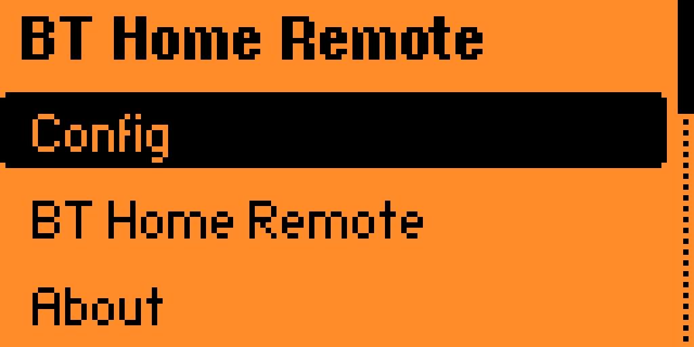
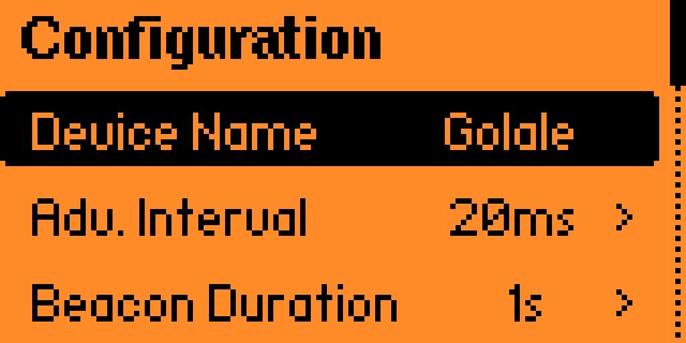
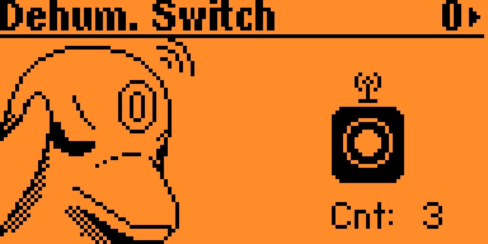

# BT Home Remote
## Description
This app implements the BT Home BLE beacon specifications. 
It allows the Flipper Zero to act as a BT Home button.

Right now both short press events and long press events are supported.

## How to use
You need a device that understand the BT Home specification. The app was tested on Home Assistant.
If the bluetooth integration is enabled correctly, BT Home devices should be automatically found by HA (HA documentation: https://www.home-assistant.io/integrations/bthome/).
After that, it can be used as a normal BT Home button in Home Assistand Automations.

In the config page the device name can be customized. The default beacon settings should be fine, but depending on the BT receiver they might need to be adjusted.

To Do:
- allow for custom MAC, right now only a fixed MAC or random MAC is available;
- release on the Flipper Store

## Screenshots

     
